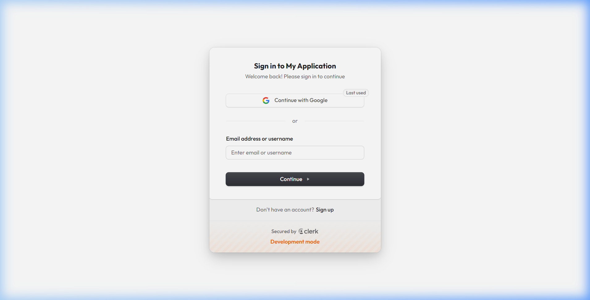
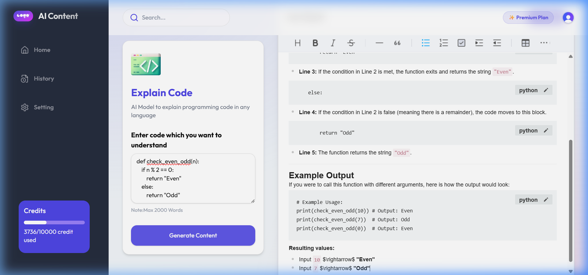

# 🧠 Lumina AI Generator

[](https://nextjs.org/)
[](https://tailwindcss.com/)
[](https://deepmind.google/technologies/gemini/)
[](https://orm.drizzle.team/)

**Lumina AI Generator** is a state-of-the-art, full-stack platform designed for modern creators. Built with a premium "Rich Aesthetic" design system, it leverages Google’s **Gemini 1.5** engine to transform ideas into high-quality, SEO-optimized content in seconds.

---

## 🎨 Premium Experience


---

## 📸 Dashboard Preview


---

## 🚀 Key Features

- 🎭 **15+ Smart Templates**: Specialized workflows for Blogs, YouTube SEO, social media, and professional coding tasks.
- 💎 **Aesthetic Design**: A modern UI featuring glassmorphism, gradient meshes, and dynamic transitions.
- ⚡ **Lightning Fast**: Powered by Next.js 15 App Router for near-instant rendering and performance.
- 🔐 **Secure Auth**: Integrated with **Clerk** for robust user management and session handling.
- 💾 **Scalable Database**: Uses **Neon Serverless PostgreSQL** with **Drizzle ORM** for efficient data persistence.
- 📝 **Rich Text Editor**: Edit and format your generated content with a professional-grade editor.

---

## 🛠️ Tech Stack

| Layer | Technologies |
| :--- | :--- |
| **Frontend** | [Next.js 15](https://nextjs.org/), [React 19](https://react.dev/), [Tailwind CSS 4](https://tailwindcss.com/) |
| **AI Engine** | [Google Generative AI (Gemini 1.5)](https://ai.google.dev/) |
| **Auth** | [Clerk](https://clerk.com/) |
| **Database** | [Neon DB](https://neon.tech/) (PostgreSQL) |
| **ORM** | [Drizzle ORM](https://orm.drizzle.team/) |
| **Payments** | [Razorpay](https://razorpay.com/) |

---

## 🔐 Secure Authentication



---

## 🏁 Getting Started

### 1. Clone the Repository
```bash
git clone https://github.com/Kusumasridongara/Lumina-AI-Generator.git
cd Lumina-AI-Generator
```

### 2. Install Dependencies
```bash
npm install --legacy-peer-deps
```

### 3. Environment Configuration
Create a `.env.local` file in the root directory and add the following:
```env
NEXT_PUBLIC_CLERK_PUBLISHABLE_KEY=your_clerk_key
CLERK_SECRET_KEY=your_clerk_secret
NEXT_PUBLIC_CLERK_SIGN_IN_URL=/sign-in
NEXT_PUBLIC_CLERK_SIGN_UP_URL=/sign-up

DATABASE_URL=your_neon_db_url

NEXT_PUBLIC_GOOGLE_GEMINI_API_KEY=your_gemini_key
```

### 4. Database Setup
```bash
npm run db:push
```

### 5. Launch Development Server
```bash
npm run dev
```
Open [http://localhost:3000](http://localhost:3000) to see your premium AI application in action!

---

## 📊 AI Templates Available

- **Blog Content & Titles**: Viral-worthy ideas and full-article generation.
- **YouTube Tools**: SEO titles, descriptions, and tag optimization.
- **Rewriting Tools**: Plagiarism-free rewriting and text improvement.
- **Social Media**: Instagram post and hashtag generators.
- **Coding Assistant**: AI-powered code generation and line-by-line explanation.





